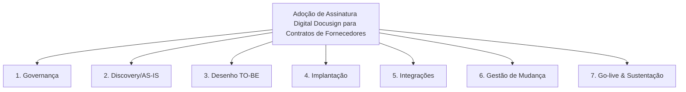

**Case:** Adoção de Assinatura Digital Docusign para Contratos de Fornecedores  
**Fase:** 02-planejamento  
**Documento:** Escopo Eap

---

## EAP (Estrutura Analítica do Projeto)

## Dicionário da EAP
| ID | Pacote | Descrição | Entregável |
|----|--------|-----------|------------|
| 1 | Governança | Charter, PMO, ritos | Plano de projeto aprovado |
| 2 | Discovery | Levantamento AS-IS | Documento AS-IS |
| 3 | Desenho | Arquitetura TO-BE | Blueprint aprovado |
| 4 | Implantação | Build da solução | Solução em QA |
| 5 | Integrações | APIs, ETLs | Integrações homologadas |
| 6 | Change | Comunicação, treino | Usuários capacitados |
| 7 | Go-live | Cutover | Solução em PROD |
